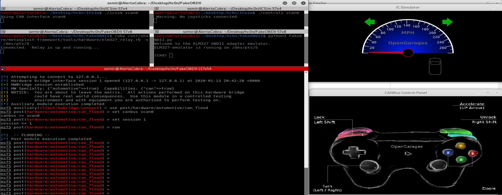

# FakeOBDII
Simulation of an OBDII port to connect metasploit-framework with ICSim.

# Disclaimer
This is a modification of https://github.com/Ircama/ELM327-emulator to use it as a wrapper between elm327_relay.rb and ICSim, by @ZombieCraig (https://github.com/zombieCraig/ICSim). Credit has been given to them.

# Prerequisites
- ICSim (https://github.com/zombieCraig/ICSim)
- Ruby (tested on ruby 2.5.7p206)
- Python3 (tested on python 3.7.5)
- python-can (pip3 install python-can)
- can-utils (sudo apt-get install can-utils)
- Serialport ruby gem (gem install serialport)

# PoC
This PoC will use FakeOBDII to link ICSim and elm327_relay.rb. After this, it is possible to use Metasploit as if we were operating with a real ELM327 bluetooth device.

- Execute setup_vcan.sh to start the virtual CAN interface. (ICSim)
  - ./setup_vcan.sh
- Start the emulator (ICSim)
  - ./icsim vcan0 and ./controls vcan0
- Init FakeOBDII: 
  - python3 FakeOBDII.py
- Execute elm327_relay.rb using the port given by FakeOBDII.py
  - /usr/share/metasploit-framework/tools/hardware/elm327_relay.rb -s /dev/pts/XXX
- Start msfconsole and create a new hwbridge session associated with elm327_relay.
  - use client/hwbridge/connect
- Use any module under post/hardware/automotive/

